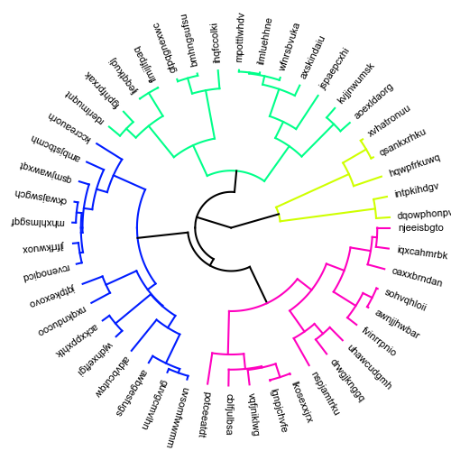

# radialtree

## What is radialtree

radialtree is a python module to draw a circular dendrogram.


## Install

git clone https://github.com/koonimaru/radialtree.git <br>
cd radialtree <br>
pip install .

## Example usage
```python
import scipy.cluster.hierarchy as sch
import numpy as np
import radialtree as rt

np.random.seed(1)
labels=[chr(i)*10 for i in range(97, 97+numleaf)]
x = np.random.rand(numleaf)
D = np.zeros([numleaf,numleaf])
for i in range(numleaf):
    for j in range(numleaf):
        D[i,j] = abs(x[i] - x[j])

#fig = pylab.figure(figsize=(8,8))

# Compute and plot the dendrogram.
#ax2 = fig.add_axes([0.3,0.71,0.6,0.2])
Y = sch.linkage(D, method='single')
Z2 = sch.dendrogram(Y,labels=labels)
rt.plot(Z2)
```